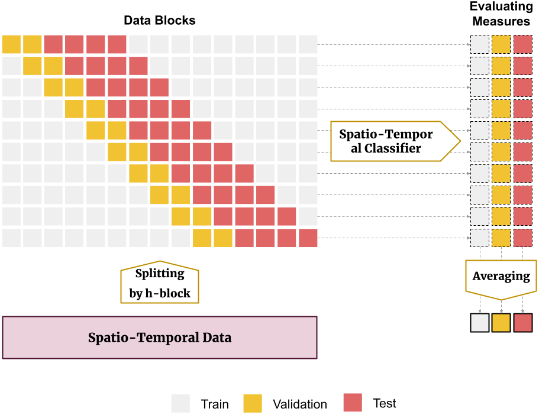
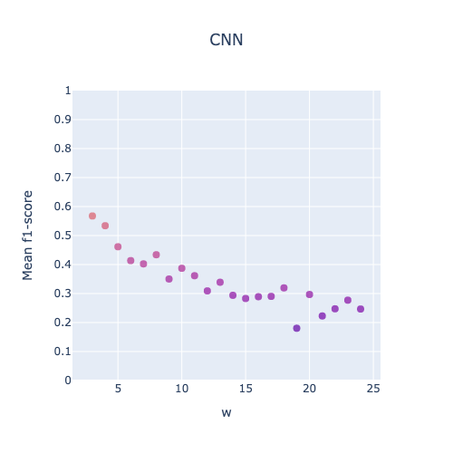
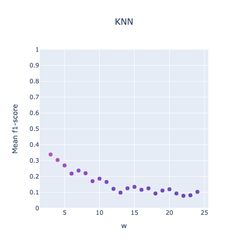
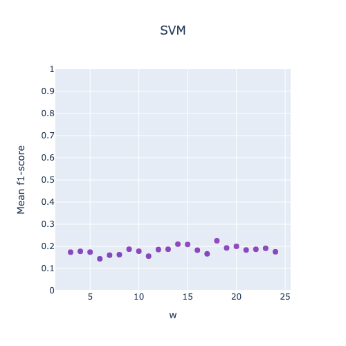
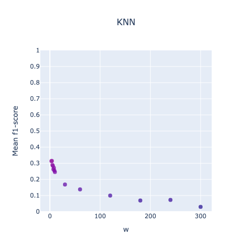
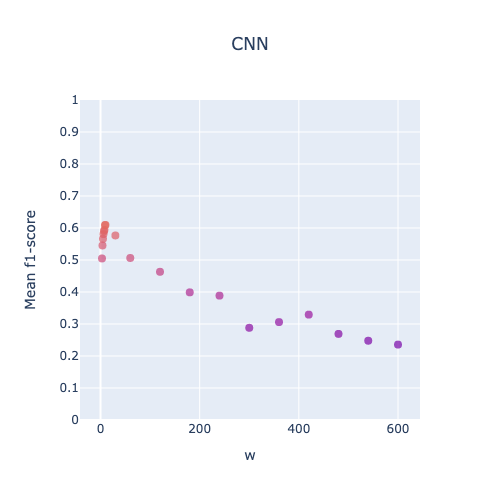
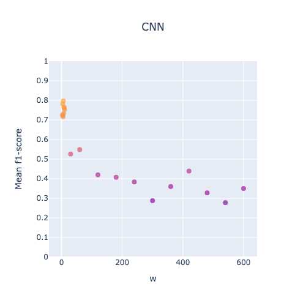
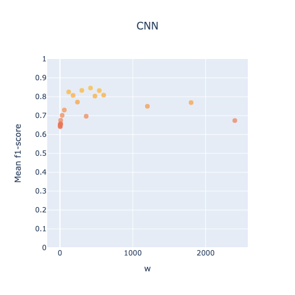

# Optimizing Neural Networks Training for Spatio-Temporal Data Classification: A Theoretical and Experimental Study on Probabilistic Fusion Using Hopping Windows

[Rouhollah Ahmadian](https://www.linkedin.com/in/ruhollah-ahmadian)1 ,
[Mehdi Ghatee](https://aut.ac.ir/cv/2174/MEHDI-GHATEE?slc_lang=en&&cv=2174&mod=scv)1,
[Johan Wahlström](https://emps.exeter.ac.uk/computer-science/staff/cw840)2 
1Amirkabir University of Technology, 2University of Exeter
<!-- ABOUT THE PROJECT -->

## About The Project

Unlocking the secrets hidden within spatio-temporal data is no easy feat, but our groundbreaking research aims to revolutionize this field. Introducing the Batch Averaging Probabilities (BAP) model, we've developed an innovative approach to tackle the intricate challenges posed by the random arrangement of primary patterns within mixed patterns. By partitioning input sequences into crafted subsequences and employing a cutting-edge training algorithm, BAP stands poised to reshape the landscape of spatio-temporal data classification. Our contributions extend beyond mere model development; we offer a deep dive into fusion methods, theoretical insights, and a game-changing training approach using fusion error-based model checkpointing. Through rigorous empirical evaluation, we showcase the unparalleled performance of our approach, elevating the standard for spatio-temporal data classification.

## Files & Directories

1. BaselineModels.ipynb: It includes the implementation of baseline models for comparison with the proposed model.
2. BaselineFusion.ipynb: It contains the implementation of models using fusion functions, averaging, and majority
   voting.
3. UserIdentificationAnalysis.ipynb: It includes the implementation of the proposed model, which is based on uncertainty
   quantification and accompanied by various analyses such as SOTA, convergence analysis (D'Alembert's Ratio Test), and
   similarity visualization.
4. ProposedModel.ipynb : It encompasses the absolute implementation of the proposed model.

## Evaluation Methodology

Given the nature of our data being signal-oriented, the technique of $h$-block cross-validation is employed for model
selection and hyperparameter tuning. The below figure shows the evaluation methodogy. Also, each class data is divided
separately and then concatenated. So all three parts have all classes. Therefore, the reported results are the average
of several expeiments.

## Datasets

#### UIFW [[1]](#1)

Theis dataset is a collection of accelerometer data obtained from an Android smartphone positioned in the chest pocket
of 22 participants who were walking in natural environments \cite{casale2012personalization}. This dataset has been
specifically curated for activity recognition research, presenting opportunities to tackle the identification and
authentication of individuals based on their motion patterns.

#### CLD [[2]](#2)

This dataset encompasses localization data recorded from a group of 5 individuals wearing tags on their left ankle,
right ankle, belt, and chest \cite{kaluvza2010agent}. It provides valuable information such as three-dimensional tag
coordinates (x, y, z), and various activities performed, including walking, falling, lying down, sitting, and standing
up.

#### HOP [[3]](#3)

With a focus on 12 healthy older adults aged between 66 and 86, this dataset captures motion data using a wearable
sensor placed at the sternum level \cite{torres2013sensor}.
The dataset is sparse and noisy due to the use of a passive sensor. The collected data includes acceleration readings in
three axes and covers activities such as sitting on a bed, sitting on a chair, lying on a bed, and ambulating (standing
and walking). The data was acquired in clinical room settings with the aid of RFID reader antennas.

#### Drivers [[4]](#4)

The dataset included three-axis accelerometer and three-axis gyroscope data from ten drivers, and the goal was to identify drivers based on their driving behaviors.

#### MFT [[5]](#5)

This dataset was generated for use on 'Prediction of Motor Failure Time Using An Artificial Neural Network' project (DOI: 10.3390/s19194342). A cooler fan with weights on its blades was used to generate vibrations. To this fan cooler was attached an accelerometer to collect the vibration data. With this data, motor failure time predictions were made, using an artificial neural networks. To generate three distinct vibration scenarios, the weights were distributed in three different ways: 1) 'red' - normal configuration: two weight pieces positioned on neighboring blades; 2) 'blue' - perpendicular configuration: two weight pieces positioned on blades forming a 90° angle; 3) 'green' - opposite configuration: two weight pieces positioned on opposite blades. A schematic diagram can be seen in figure 3 of the paper.

#### PC [[6]](#6)

The dataset provided information about power consumption such as temperature, humidity, wind speed, consumption, general diuse flows, diuse flows in three zones of Tetouan City, which is suitable for predicting a zone based on consumption information.

#### PRSA [[7]](#7)

The dataset includes hourly air pollutant data such as PM2.5, PM10, SO2, NO2, CO, O3, temperature, pressure, dew point temperature, precipitation, wind direction, wind speed from 12 air-quality monitoring sites, and the proposed model predicted the sites based on their air-quality information.

#### RSSI [[8]](#8)

The dataset was collected with help of students. Twelve students were divided to three groups and each student had iTAG device. They walked inside their limited area with activated iTAG. In long corridor, 18.35m x 3m, we denoted 3 areas which illustrate building's entry: inside, in vestibule and outside. Two smartphones, Sony Xperia XA1, received signals. They located at the start and end of 'in vestibule' area, which has length of 2.35m. Collection of RSSIs lasted for 20 minutes.
There are two datasets: filtered_rssi and raw_rssi. We used feedback filter to smooth RSSI. Raw RSSIs are actual RSSIs that smartphone got.
While the primary task was indoor localization, the proposed model aimed to identify participants based on their location.

#### WISDM [[9]](#9)

For a detailed description of the dataset, please see the following pdf file that is stored with the data: WISDM-dataset-description.pdf. The raw accelerometer and gyroscope sensor data is collected from the smartphone and smartwatch at a rate of 20Hz. It is collected from 51 test subjects as they perform 18 activities for 3 minutes apiece. The sensor data for each device (phone, watch) and type of sensor (accelerometer, gyroscope) is stored in a different directory (so there are 4 data directories). In each directory there are 51 files corresponding to the 51 test subjects. The format of every entry is the same: . The descriptions of these attributes are provided with the attribute information. In addition to the raw time-series sensor data we also generate examples that describe the sensor data using a 10-second window. See the dataset description document for details. Although this data can most naturally be used for activity recognition, it can also be used to build behavioral biometric models since each sensor reading is associated with a specific subject.

#### Dataset \#2 (DB2) [[10]](#10)

Gait data from 20 subjects segmented with a sliding window approach (window length: 128, no overlap). Dataset split into
70\% training and 30\% testing sets.

#### UCI-HAR (HAR): [[11]](#11)

Accelerometer and gyroscope data from 30 volunteers (19-48 years) preprocessed with low-pass filters. Segmented into
fixed-width sliding windows (2.56s, 50\% overlap). Dataset divided into 70\% training and 30\% testing sets.

## Hyperparameters

It is important to optimize parameters to have a fair comparison between the proposed model and baseline models.
We use grid search to find the best model configurations.
The hyperparameters of this project:

* `w`: it refers to the window length used in segmentation.
* `r`: it is the window overlap. `r` is fixed at 75\% for all experiments.
* `s`: it only relates to recurrent models. It shows the input sequence length, while `w` is the hidden unit length for
  each subsequence.

#### Hyperparameters Tuning based on UIFW Dataset

|                                                                                     |                                                                                          |                                                                                              |
|:-----------------------------------------------------------------------------------:|:----------------------------------------------------------------------------------------:|:--------------------------------------------------------------------------------------------:|
|    |            |               |
|       |            |  |
|       |  |                |

#### Hyperparameters Tuning based on CLD Dataset

|                                                                                     |                                                                                          |                                                                                              |
|:-----------------------------------------------------------------------------------:|:----------------------------------------------------------------------------------------:|:--------------------------------------------------------------------------------------------:|
|    |            |               |
|       |            |  |
|       |  |                |

#### Hyperparameters Tuning based on HOP Dataset

|                                                                                     |                                                                                          |                                                                                              |
|:-----------------------------------------------------------------------------------:|:----------------------------------------------------------------------------------------:|:--------------------------------------------------------------------------------------------:|
|    |            |               |
|       |            |  |
|       |  |                |

#### Hyperparameters Tuning based on Drivers Dataset

|                                                                                     |                                                                                          |                                                                                              |
|:-----------------------------------------------------------------------------------:|:----------------------------------------------------------------------------------------:|:--------------------------------------------------------------------------------------------:|
|    |            |               |
|       |            |  |
|       |  |                |

#### Hyperparameters Tuning based on MFT Dataset

|                                                                                     |                                                                                          |                                                                                              |
|:-----------------------------------------------------------------------------------:|:----------------------------------------------------------------------------------------:|:--------------------------------------------------------------------------------------------:|
|    |            |               |
|       |            |  |
|       |  |                |

#### Hyperparameters Tuning based on PC Dataset

|                                                                                     |                                                                                          |                                                                                              |
|:-----------------------------------------------------------------------------------:|:----------------------------------------------------------------------------------------:|:--------------------------------------------------------------------------------------------:|
|    |            |               |
|       |            |  |
|       |  |                |

#### Hyperparameters Tuning based on PRSA Dataset

|                                                                                     |                                                                                          |                                                                                              |
|:-----------------------------------------------------------------------------------:|:----------------------------------------------------------------------------------------:|:--------------------------------------------------------------------------------------------:|
|    |            |               |
|       |            |  |
|       |  |                |

#### Hyperparameters Tuning based on RSSI Dataset

|                                                                                     |                                                                                          |                                                                                              |
|:-----------------------------------------------------------------------------------:|:----------------------------------------------------------------------------------------:|:--------------------------------------------------------------------------------------------:|
|    |            |               |
|       |            |  |
|       |  |                |

#### Hyperparameters Tuning based on WISDM Dataset

|                                                                                     |                                                                                          |                                                                                              |
|:-----------------------------------------------------------------------------------:|:----------------------------------------------------------------------------------------:|:--------------------------------------------------------------------------------------------:|
|    |            |               |
|       |            |  |
|       |  |                |

## Comparison of the proposed model with the baseline models in terms of F1-Score

| Dataset |          Model           |   `w`    |   `s`    |      F1-Score      |
|:-------:|:------------------------:|:--------:|:--------:|:------------------:|
|   CLD   |           KNN            | 00:00:03 |    -     |   25.50 (± 0.02)   |
|   CLD   |           MLP            | 00:00:04 |    -     |   33.45 (± 0.12)   |
|   CLD   |            RF            | 00:00:08 |    -     |   07.62 (± 0.01)   |
|   CLD   |            LR            | 00:02:00 |    -     |   30.43 (± 0.14)   |
|   CLD   |           SVM            | 00:02:00 |    -     |   31.53 (± 0.17)   |
|   CLD   |           CNN            | 00:00:03 |    -     |   56.71 (± 0.10)   |
|   CLD   |           GRU            | 00:00:10 | 00:00:30 |   39.65 (± 0.06)   |
|   CLD   |           LSTM           | 00:00:03 | 00:00:09 |   37.25 (± 0.04)   |
|   CLD   |          BiLSTM          | 00:00:07 | 00:01:00 |   52.22 (± 0.12)   |
|   CLD   |         ConvLSTM         | 00:00:03 | 00:04:00 |   36.33 (± 0.03)   |
|   CLD   | Fusion (Majority Voting) | 00:00:03 | 00:02:00 |   95.30 (± 0.05)   |
|   CLD   |    Fusion (Averaging)    | 00:00:03 | 00:02:00 | **95.49 (± 0.04)** |
|   HOP   |           KNN            | 00:00:04 |    -     |   31.47 (± 0.06)   |
|   HOP   |           MLP            | 00:00:04 |    -     |   30.38 (± 0.06)   |
|   HOP   |            RF            | 00:00:03 |    -     |   31.60 (± 0.06)   |
|   HOP   |            LR            | 00:00:30 |    -     |   19.63 (± 0.04)   |
|   HOP   |           SVM            | 00:00:30 |    -     |   16.86 (± 0.04)   |
|   HOP   |           CNN            | 00:00:06 |    -     |   37.09 (± 0.07)   |
|   HOP   |           GRU            | 00:00:06 | 00:00:10 |   36.84 (± 0.07)   |
|   HOP   |           LSTM           | 00:00:03 | 00:00:08 |   36.45 (± 0.06)   |
|   HOP   |          BiLSTM          | 00:00:06 | 00:00:10 |   36.91 (± 0.06)   |
|   HOP   |         ConvLSTM         | 00:00:03 | 00:00:09 |   32.06 (± 0.06)   |
|   HOP   | Fusion (Majority Voting) | 00:00:08 | 00:03:00 |   62.40 (± 0.08)   |
|   HOP   |    Fusion (Averaging)    | 00:00:08 | 00:03:00 | **64.63 (± 0.08)** |
|  UIFW   |           KNN            | 00:00:03 |    -     |   33.92 (± 0.03)   |
|  UIFW   |           MLP            | 00:00:03 |    -     |   40.76 (± 0.05)   |
|  UIFW   |            RF            | 00:00:03 |    -     |   12.43 (± 0.02)   |
|  UIFW   |            LR            | 00:00:08 |    -     |   26.66 (± 0.04)   |
|  UIFW   |           SVM            | 00:00:18 |    -     |   22.52 (± 0.04)   |
|  UIFW   |           CNN            | 00:00:03 |    -     |   56.75 (± 0.05)   |
|  UIFW   |           GRU            | 00:00:03 | 00:00:06 |   54.56 (± 0.07)   |
|  UIFW   |           LSTM           | 00:00:03 | 00:00:06 |   56.10 (± 0.07)   |
|  UIFW   |          BiLSTM          | 00:00:03 | 00:00:20 |   66.56 (± 0.06)   |
|  UIFW   |         ConvLSTM         | 00:00:03 | 00:00:05 |   48.18 (± 0.08)   |
|  UIFW   | Fusion (Majority Voting) | 00:00:03 | 00:00:22 |   85.57 (± 0.08)   |
|  UIFW   |    Fusion (Averaging)    | 00:00:03 | 00:00:22 | **85.74 (± 0.09)** |

## Benchmark

A comparison was made between this study and previous works [[4]](#4) and [[5]](#5) using the DB2 and HAR datasets,
which were also used in those studies.
To ensure a fair evaluation, the same dataset configurations were followed as in the prior work.
Both datasets were pre-segmented into standardized train/test splits, and 20% of the training data was set aside for
validation.
The following hyperparameters were used: window size (`w`) of 32 seconds, receptive field size (`r`) of 24 seconds,
stride (`s`) of 128 seconds, learning rate (`lr`) of 0.0001, batch size of 32, 50 epochs, and a maximum number of
iterations (`M`) set to 200.

| Dataset |      Ref.      |  MSE   | F1-Score  |  Recall   | Precision | Accuracy  |
|:-------:|:--------------:|:------:|:---------:|:---------:|:---------:|:---------:|
|   DB2   |   [[10]](#4)   |   -    |     -     |     -     |     -     |   97.33   |
|   DB2   | **Our Fusion** | 0.0013 |   96.63   |   96.51   |   98.75   | **98.41** |
|   HAR   |   [[11]](#5)   |   -    |   91.18   |   91.27   |     -     |   91.31   |
|   HAR   | **Our Fusion** | 0.0099 | **98.94** | **98.93** |   99.04   | **98.98** |

## References

<a id="1">[1]</a>
https://archive.ics.uci.edu/ml/datasets/User+Identification+From+Walking+Activity

<a id="1">[2]</a>
https://archive.ics.uci.edu/ml/datasets/Localization+Data+for+Person+Activity

<a id="1">[3]</a>
https://archive.ics.uci.edu/ml/datasets/Activity+recognition+with+healthy+older+people+using+a+batteryless+wearable+sensor

<a id="1">[4]</a>
https://github.com/mghatee/Overall-Driving-Behavior-Recognition-By-Smartphone

<a id="1">[5]</a>
https://archive.ics.uci.edu/ml/datasets/Accelerometer

<a id="1">[6]</a>
https://archive.ics.uci.edu/ml/datasets/Power+consumption+of+Tetouan+city

<a id="1">[7]</a>
https://archive.ics.uci.edu/ml/datasets/Beijing+Multi-Site+Air-Quality+Data

<a id="1">[8]</a>
https://archive.ics.uci.edu/ml/datasets/BLE+RSSI+dataset+for+Indoor+localization

<a id="1">[9]</a>
https://archive.ics.uci.edu/ml/datasets/WISDM+Smartphone+and+Smartwatch+Activity+and+Biometrics+Dataset+

<a id="1">[10]</a>
Zou, Qin, et al. "Deep learning-based gait recognition using smartphones in the wild." IEEE Transactions on Information
Forensics and Security 15 (2020): 3197-3212.

<a id="1">[11]</a>
Luo, Fei, et al. "Activity-based person identification using multimodal wearable sensor data." IEEE Internet of Things
Journal 10.2 (2022): 1711-1723.